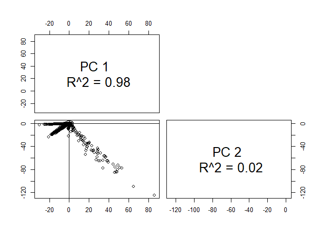

APS-Failure-at-Scania-Trucks
================
Xinyu Tian
March 15, 2018
================
``` r
# source("https://bioconductor.org/biocLite.R")
# biocLite("pcaMethods")
library(pcaMethods)
library(data.table)
library(dplyr)
library(ranger)
library(caret)
library(unbalanced)
library(naivebayes)
library(rpart)
library(mice)
library(ggplot2)
library(VIM)
library(pROC)
```

# Preparation

## read the dataset

``` r
tra <- fread("aps_failure_training_set.csv", na.strings = "NA", strip.white = TRUE)
```

    ## 
    Read 66.7% of 60000 rows
    Read 83.3% of 60000 rows
    Read 60000 rows and 171 (of 171) columns from 0.042 GB file in 00:00:04

``` r
tes <- fread("aps_failure_test_set.csv", na.strings = "NA", strip.white = TRUE)
```

## map class value \[“neg”, “pos”\] to \[0,1\]

``` r
tra$class[tra$class == "neg"] <- 0
tra$class[tra$class == "pos"] <- 1

tes$class[tes$class == "neg"] <- 0
tes$class[tes$class == "pos"] <- 1
```

## visualize class value distributions

``` r
qplot(as.factor(tra$class), xlab = "class")
```

<!-- -->

## convert every attribute into numeric type

``` r
tra <- tra %>% mutate_if(sapply(tra, is.character), as.numeric)
tes <- tes %>% mutate_if(sapply(tes, is.character), as.numeric)
```

## slice the features/predictors

``` r
tra_fea <- tra[,2:ncol(tra)]
tes_fea <- tes[,2:ncol(tes)]
```

# Heuristic Feature Selection

## remove columns where over 60% of instances are missing

``` r
col_miss <- lapply(tra_fea, function(col){sum(is.na(col))/length(col)})
tra_fea <- tra_fea[, !(names(tra_fea) %in% names(col_miss[lapply(col_miss, function(x) x) > 0.6]))]
```

## remove columns where over 90% of instance values are zero

``` r
col_zero <- lapply(tra_fea, function(col){length(which(col==0))/length(col)})
tra_fea <- tra_fea[, !(names(tra_fea) %in% names(col_zero[lapply(col_zero, function(x) x) > 0.9]))]
```

## remove columns where the standard derivation is zero

``` r
col_std <- lapply(tra_fea, function(col){sd(col, na.rm = TRUE)})
tra_fea <- tra_fea[, !(names(tra_fea) %in% names(col_std[lapply(col_std, function(x) x) == 0]))]
```

## also apply to test set

``` r
tes_fea <- tes_fea[, names(tes_fea) %in% names(tra_fea)]
```

# Multicollinearity Detection

## PCA attempts - select Bayesian PCA which tolerates missing data

``` r
tra_pca <- pca(tra_fea, method="bpca")
tes_pca <- pca(tes_fea, method="bpca")
```

## visualize PCA

``` r
plotPcs(tra_pca)
```

<!-- -->
# Missing Data Imputation 
## visualize the missing value patterns

``` r
miss <- aggr(tra_fea[1:300,], plot = TRUE)
```

<!-- -->
## fill NA by Bayesian PCA

``` r
tra_mi <- as.data.frame(cbind(tra$class, completeObs(tra_pca)))
colnames(tra_mi)[1] <- 'class'
summary(tra_mi)
```

    ##      class             aa_000            ac_000          
    ##  Min.   :0.00000   Min.   :      0   Min.   :-2.307e+10  
    ##  1st Qu.:0.00000   1st Qu.:    834   1st Qu.: 1.400e+01  
    ##  Median :0.00000   Median :  30776   Median : 1.500e+02  
    ##  Mean   :0.01667   Mean   :  59337   Mean   : 2.825e+08  
    ##  3rd Qu.:0.00000   3rd Qu.:  48668   3rd Qu.: 1.116e+03  
    ##  Max.   :1.00000   Max.   :2746564   Max.   : 6.710e+10  
    ##      ad_000               ag_003             ag_004         
    ##  Min.   :  -3367463   Min.   : -202722   Min.   :  -645964  
    ##  1st Qu.:        42   1st Qu.:       0   1st Qu.:      318  
    ##  Median :       286   Median :       0   Median :     3874  
    ##  Mean   :    203455   Mean   :   89109   Mean   :   439018  
    ##  3rd Qu.:      6926   3rd Qu.:       0   3rd Qu.:    53564  
    ##  Max.   :8584297742   Max.   :63402074   Max.   :228830570  
    ##      ag_005              ag_006             ag_007        
    ##  Min.   :  -912352   Min.   : -642721   Min.   : -134333  
    ##  1st Qu.:    14302   1st Qu.:   11097   1st Qu.:       0  
    ##  Median :   184812   Median :  972862   Median :  127806  
    ##  Mean   :  1111882   Mean   : 1661709   Mean   :  500383  
    ##  3rd Qu.:   952722   3rd Qu.: 1908068   3rd Qu.:  599034  
    ##  Max.   :179187978   Max.   :94020666   Max.   :63346754  
    ##      ag_008             ag_009             ah_000        
    ##  Min.   :  -10205   Min.   :   -8649   Min.   : -681390  
    ##  1st Qu.:       0   1st Qu.:       0   1st Qu.:   30360  
    ##  Median :    2012   Median :       0   Median : 1012842  
    ##  Mean   :   35651   Mean   :    5138   Mean   : 1816499  
    ##  3rd Qu.:   28041   3rd Qu.:     442   3rd Qu.: 1637340  
    ##  Max.   :17702522   Max.   :25198514   Max.   :74247318  
    ##      ai_000             aj_000            al_000        
    ##  Min.   :  -27001   Min.   :  -2182   Min.   : -110003  
    ##  1st Qu.:       0   1st Qu.:      0   1st Qu.:       0  
    ##  Median :       0   Median :      0   Median :       0  
    ##  Mean   :    9106   Mean   :   1152   Mean   :   59705  
    ##  3rd Qu.:       0   3rd Qu.:      0   3rd Qu.:    1334  
    ##  Max.   :16512852   Max.   :5629340   Max.   :34762578  
    ##       am_0              an_000              ao_000         
    ##  Min.   : -190738   Min.   : -1460104   Min.   : -1193907  
    ##  1st Qu.:       0   1st Qu.:    74410   1st Qu.:    66521  
    ##  Median :       0   Median :  1942503   Median :  1659256  
    ##  Mean   :   94217   Mean   :  3475541   Mean   :  3011687  
    ##  3rd Qu.:    2580   3rd Qu.:  3205432   3rd Qu.:  2737346  
    ##  Max.   :55903508   Max.   :140861830   Max.   :122201822  
    ##      ap_000             aq_000             at_000             av_000      
    ##  Min.   :-1071824   Min.   : -373071   Min.   :   -2794   Min.   :     0  
    ##  1st Qu.:   25673   1st Qu.:    4232   1st Qu.:       0   1st Qu.:    12  
    ##  Median :  363884   Median :  181952   Median :       0   Median :   138  
    ##  Mean   : 1010253   Mean   :  444124   Mean   :    5093   Mean   :  1192  
    ##  3rd Qu.:  741810   3rd Qu.:  385794   3rd Qu.:       0   3rd Qu.:   804  
    ##  Max.   :77934944   Max.   :25562646   Max.   :10400504   Max.   :794458  
    ##      ax_000             ay_005              ay_006         
    ##  Min.   :     0.0   Min.   :  -279030   Min.   :  -317760  
    ##  1st Qu.:    12.0   1st Qu.:        0   1st Qu.:        0  
    ##  Median :    74.0   Median :        0   Median :   182097  
    ##  Mean   :   401.6   Mean   :   112703   Mean   :  1081155  
    ##  3rd Qu.:   300.0   3rd Qu.:    43130   3rd Qu.:  1294224  
    ##  Max.   :116652.0   Max.   :124948914   Max.   :127680326  
    ##      ay_007              ay_008              az_000        
    ##  Min.   : -1227586   Min.   :  -658852   Min.   :   -9020  
    ##  1st Qu.:     6434   1st Qu.:     7684   1st Qu.:    1040  
    ##  Median :   368353   Median :    99973   Median :    2130  
    ##  Mean   :  1551346   Mean   :  1054497   Mean   :    7882  
    ##  3rd Qu.:  1371906   3rd Qu.:   651387   3rd Qu.:    4264  
    ##  Max.   :489678156   Max.   :104566992   Max.   :10124620  
    ##      az_001            az_002             az_003        
    ##  Min.   :  -5987   Min.   :  -12458   Min.   :  -32026  
    ##  1st Qu.:     60   1st Qu.:      92   1st Qu.:     308  
    ##  Median :    656   Median :    1044   Median :    3758  
    ##  Mean   :   4441   Mean   :    8106   Mean   :   87472  
    ##  3rd Qu.:   2110   3rd Qu.:    3274   3rd Qu.:   46590  
    ##  Max.   :4530258   Max.   :14217662   Max.   :45584242  
    ##      az_004              az_005              az_006        
    ##  Min.   : -1060376   Min.   : -1563963   Min.   :       0  
    ##  1st Qu.:     1594   1st Qu.:    40174   1st Qu.:      10  
    ##  Median :    90342   Median :   543564   Median :     312  
    ##  Mean   :  1481639   Mean   :  2142744   Mean   :  101953  
    ##  3rd Qu.:  1797752   3rd Qu.:  1881469   3rd Qu.:    4574  
    ##  Max.   :123047106   Max.   :467832334   Max.   :64589140  
    ##      az_007             ba_000              ba_001         
    ##  Min.   :       0   Min.   :  -827851   Min.   :  -604532  
    ##  1st Qu.:       0   1st Qu.:    34260   1st Qu.:    15606  
    ##  Median :       0   Median :   692073   Median :   453518  
    ##  Mean   :   17403   Mean   :  1403616   Mean   :   896811  
    ##  3rd Qu.:       0   3rd Qu.:  1310548   3rd Qu.:   829878  
    ##  Max.   :39158218   Max.   :232871714   Max.   :116283282  
    ##      ba_002             ba_003             ba_004        
    ##  Min.   : -358932   Min.   : -218979   Min.   : -149317  
    ##  1st Qu.:    5464   1st Qu.:    1942   1st Qu.:     634  
    ##  Median :  189608   Median :  136899   Median :  103821  
    ##  Mean   :  414481   Mean   :  274889   Mean   :  205507  
    ##  3rd Qu.:  348654   3rd Qu.:  250449   3rd Qu.:  201432  
    ##  Max.   :55807388   Max.   :36931418   Max.   :25158556  
    ##      ba_005             ba_006             ba_007        
    ##  Min.   : -132043   Min.   : -155892   Min.   :  -68618  
    ##  1st Qu.:     386   1st Qu.:     360   1st Qu.:      76  
    ##  Median :   85953   Median :   74382   Median :    5595  
    ##  Mean   :  189509   Mean   :  211272   Mean   :  186240  
    ##  3rd Qu.:  188945   3rd Qu.:  210611   3rd Qu.:  213289  
    ##  Max.   :19208664   Max.   :18997660   Max.   :14314086  
    ##      ba_008             ba_009             bb_000         
    ##  Min.   :  -44238   Min.   :  -25463   Min.   : -2649196  
    ##  1st Qu.:       0   1st Qu.:       0   1st Qu.:   107178  
    ##  Median :      24   Median :       0   Median :  2384734  
    ##  Mean   :   36029   Mean   :   35888   Mean   :  4544777  
    ##  3rd Qu.:    2244   3rd Qu.:      76   3rd Qu.:  3949874  
    ##  Max.   :31265984   Max.   :43706408   Max.   :192871534  
    ##      bc_000             bd_000              be_000        
    ##  Min.   :  -168.7   Min.   :   -17.89   Min.   :  -320.5  
    ##  1st Qu.:     0.0   1st Qu.:    10.00   1st Qu.:    22.0  
    ##  Median :    20.0   Median :    78.00   Median :   200.0  
    ##  Mean   :   674.0   Mean   :  1063.82   Mean   :  1605.3  
    ##  3rd Qu.:   180.0   3rd Qu.:   524.00   3rd Qu.:   712.0  
    ##  Max.   :396952.0   Max.   :306452.00   Max.   :810568.0  
    ##      bf_000             bg_000             bh_000       
    ##  Min.   :  -33.87   Min.   : -679153   Min.   : -40311  
    ##  1st Qu.:    0.00   1st Qu.:   30378   1st Qu.:    866  
    ##  Median :    2.00   Median : 1013211   Median :  26771  
    ##  Mean   :   93.36   Mean   : 1816905   Mean   :  58227  
    ##  3rd Qu.:   22.18   3rd Qu.: 1639004   3rd Qu.:  50232  
    ##  Max.   :51050.00   Max.   :74247318   Max.   :3200582  
    ##      bi_000             bj_000             bk_000            bl_000       
    ##  Min.   : -307172   Min.   : -759966   Min.   :      0   Min.   :      0  
    ##  1st Qu.:   16140   1st Qu.:    8662   1st Qu.: 191480   1st Qu.: 213680  
    ##  Median :  182672   Median :  156430   Median : 265990   Median : 320840  
    ##  Mean   :  494082   Mean   :  512707   Mean   : 280359   Mean   : 321300  
    ##  3rd Qu.:  388384   3rd Qu.:  341546   3rd Qu.: 285837   3rd Qu.: 327339  
    ##  Max.   :44937496   Max.   :45736316   Max.   :1310700   Max.   :1310700  
    ##      bs_000            bt_000              bu_000         
    ##  Min.   :      0   Min.   : -32657.4   Min.   : -2642608  
    ##  1st Qu.:  17560   1st Qu.:    866.2   1st Qu.:   107272  
    ##  Median :  51780   Median :  30874.4   Median :  2385102  
    ##  Mean   :  80428   Mean   :  59416.6   Mean   :  4541489  
    ##  3rd Qu.: 117865   3rd Qu.:  48961.6   3rd Qu.:  3950192  
    ##  Max.   :1037240   Max.   :2746564.8   Max.   :192871534  
    ##      bv_000              bx_000              by_000       
    ##  Min.   : -2642607   Min.   : -2725555   Min.   : -13528  
    ##  1st Qu.:   107272   1st Qu.:    99234   1st Qu.:    221  
    ##  Median :  2385102   Median :  2378291   Median :  12772  
    ##  Mean   :  4541490   Mean   :  4231934   Mean   :  22046  
    ##  3rd Qu.:  3950192   3rd Qu.:  3929638   3rd Qu.:  20630  
    ##  Max.   :192871534   Max.   :186353854   Max.   :1002003  
    ##      bz_000             ca_000           cb_000            cc_000         
    ##  Min.   :  -42267   Min.   :     0   Min.   :      0   Min.   : -2662980  
    ##  1st Qu.:      12   1st Qu.:  7892   1st Qu.:  78715   1st Qu.:    72341  
    ##  Median :    1275   Median : 30567   Median : 287500   Median :  2218811  
    ##  Mean   :  129368   Mean   : 39891   Mean   : 405736   Mean   :  3914798  
    ##  3rd Qu.:   20046   3rd Qu.: 65952   3rd Qu.: 699215   3rd Qu.:  3653858  
    ##  Max.   :40542588   Max.   :694123   Max.   :1209520   Max.   :148615188  
    ##      ce_000            cf_000               cg_000       
    ##  Min.   :      0   Min.   :  -3376495   Min.   :    0.0  
    ##  1st Qu.:    300   1st Qu.:         0   1st Qu.:   12.0  
    ##  Median :   4990   Median :         2   Median :   76.0  
    ##  Mean   :  68012   Mean   :    203057   Mean   :  113.9  
    ##  3rd Qu.:  90026   3rd Qu.:      1314   3rd Qu.:  107.7  
    ##  Max.   :4908098   Max.   :8584297736   Max.   :21400.0  
    ##      ch_000               ci_000              cj_000        
    ##  Min.   :-0.0036398   Min.   : -2090814   Min.   : -193575  
    ##  1st Qu.: 0.0000000   1st Qu.:    48997   1st Qu.:       0  
    ##  Median : 0.0000000   Median :  1865202   Median :       0  
    ##  Mean   : 0.0004827   Mean   :  3479047   Mean   :  102726  
    ##  3rd Qu.: 0.0000000   3rd Qu.:  2967960   3rd Qu.:       0  
    ##  Max.   : 2.0000000   Max.   :140986130   Max.   :60949671  
    ##      ck_000             cl_000             cm_000       
    ##  Min.   : -620892   Min.   :  -465.9   Min.   : -117.8  
    ##  1st Qu.:   14747   1st Qu.:     0.0   1st Qu.:    0.0  
    ##  Median :  251694   Median :     0.0   Median :   20.0  
    ##  Mean   :  713831   Mean   :   405.2   Mean   :  391.7  
    ##  3rd Qu.:  554080   3rd Qu.:    24.0   3rd Qu.:  395.4  
    ##  Max.   :55428669   Max.   :130560.0   Max.   :73370.0  
    ##      cn_001             cn_002             cn_003        
    ##  Min.   :  -52488   Min.   : -290422   Min.   : -684210  
    ##  1st Qu.:       0   1st Qu.:       0   1st Qu.:    4736  
    ##  Median :       0   Median :       0   Median :   36306  
    ##  Mean   :   22087   Mean   :  161873   Mean   :  533670  
    ##  3rd Qu.:       0   3rd Qu.:    8824   3rd Qu.:  247629  
    ##  Max.   :14512994   Max.   :58508606   Max.   :94979324  
    ##      cn_004              cn_005              cn_006        
    ##  Min.   :  -984893   Min.   :  -513656   Min.   :  -31018  
    ##  1st Qu.:    19864   1st Qu.:     5310   1st Qu.:     640  
    ##  Median :   533081   Median :   733820   Median :  102324  
    ##  Mean   :  1286849   Mean   :  1344328   Mean   :  411358  
    ##  3rd Qu.:  1237502   3rd Qu.:  1539835   3rd Qu.:  459018  
    ##  Max.   :169869316   Max.   :117815764   Max.   :72080406  
    ##      cn_007             cn_008            cn_009        
    ##  Min.   :   -6678   Min.   :      0   Min.   :  -19493  
    ##  1st Qu.:      66   1st Qu.:      0   1st Qu.:       0  
    ##  Median :   10344   Median :   1938   Median :      28  
    ##  Mean   :   64562   Mean   :  19264   Mean   :    7873  
    ##  3rd Qu.:   32317   3rd Qu.:   5476   3rd Qu.:     310  
    ##  Max.   :33143734   Max.   :7541716   Max.   :36398374  
    ##      co_000               cp_000             cq_000         
    ##  Min.   :  -3348914   Min.   :   -93.0   Min.   : -2642607  
    ##  1st Qu.:         2   1st Qu.:     6.0   1st Qu.:   107272  
    ##  Median :        32   Median :    16.0   Median :  2385102  
    ##  Mean   :    203400   Mean   :   695.8   Mean   :  4541489  
    ##  3rd Qu.:      9326   3rd Qu.:   112.0   3rd Qu.:  3950192  
    ##  Max.   :8584297742   Max.   :496360.0   Max.   :192871534  
    ##      cs_000           cs_001             cs_002             cs_003        
    ##  Min.   :     0   Min.   :  -575.8   Min.   : -438562   Min.   : -278763  
    ##  1st Qu.:  1238   1st Qu.:    32.0   1st Qu.:     238   1st Qu.:    3198  
    ##  Median :  3242   Median :   368.0   Median :   22096   Median :  124615  
    ##  Mean   :  5489   Mean   :   790.8   Mean   :  239980   Mean   :  356471  
    ##  3rd Qu.:  5760   3rd Qu.:   710.0   3rd Qu.:   99162   3rd Qu.:  305365  
    ##  Max.   :839240   Max.   :438806.0   Max.   :46085940   Max.   :42421854  
    ##      cs_004             cs_005              cs_006        
    ##  Min.   : -799497   Min.   : -1312428   Min.   :       0  
    ##  1st Qu.:    2812   1st Qu.:    19874   1st Qu.:   14032  
    ##  Median :   92948   Median :  1246185   Median :  251033  
    ##  Mean   :  446381   Mean   :  2241551   Mean   :  546335  
    ##  3rd Qu.:  215084   3rd Qu.:  2088970   3rd Qu.:  680782  
    ##  Max.   :74860628   Max.   :379142116   Max.   :73741974  
    ##      cs_007             cs_008              ct_000        
    ##  Min.   :       0   Min.   :      0.0   Min.   :     0.0  
    ##  1st Qu.:    1228   1st Qu.:      2.0   1st Qu.:    66.0  
    ##  Median :    6332   Median :     48.0   Median :   428.0  
    ##  Mean   :   14782   Mean   :    211.8   Mean   :   781.7  
    ##  3rd Qu.:   18002   3rd Qu.:    154.0   3rd Qu.:   771.5  
    ##  Max.   :12884218   Max.   :1584558.0   Max.   :910366.0  
    ##      cu_000           cv_000             cx_000             cy_000        
    ##  Min.   :     0   Min.   :       0   Min.   : -358736   Min.   :     0.0  
    ##  1st Qu.:   126   1st Qu.:   68664   1st Qu.:    6954   1st Qu.:     0.0  
    ##  Median :   526   Median : 1990002   Median :   69609   Median :     0.0  
    ##  Mean   :  1416   Mean   : 2146109   Mean   :  447329   Mean   :   309.0  
    ##  3rd Qu.:  1318   3rd Qu.: 2365741   3rd Qu.:  444710   3rd Qu.:   120.9  
    ##  Max.   :733688   Max.   :81610510   Max.   :44105494   Max.   :931472.0  
    ##      cz_000             da_000              db_000       
    ##  Min.   :       0   Min.   :    0.000   Min.   :   0.00  
    ##  1st Qu.:      16   1st Qu.:    0.000   1st Qu.:   0.00  
    ##  Median :    1677   Median :    0.000   Median :  10.00  
    ##  Mean   :   21913   Mean   :    8.062   Mean   :  13.70  
    ##  3rd Qu.:   19014   3rd Qu.:    0.000   3rd Qu.:  14.77  
    ##  Max.   :19156530   Max.   :21006.000   Max.   :9636.00  
    ##      dc_000              dd_000           de_000           dh_000         
    ##  Min.   :        0   Min.   :     0   Min.   :     0   Min.   :   -48604  
    ##  1st Qu.:    72307   1st Qu.:   140   1st Qu.:    68   1st Qu.:        0  
    ##  Median :  2247700   Median :  1440   Median :   152   Median :        0  
    ##  Mean   :  2451948   Mean   :  3623   Mean   :   406   Mean   :    20379  
    ##  3rd Qu.:  2659922   3rd Qu.:  2900   3rd Qu.:   326   3rd Qu.:        0  
    ##  Max.   :120759484   Max.   :445142   Max.   :176176   Max.   :124700880  
    ##      di_000             dn_000            do_000            dp_000      
    ##  Min.   : -101399   Min.   : -25590   Min.   :      0   Min.   :     0  
    ##  1st Qu.:       0   1st Qu.:    668   1st Qu.:     32   1st Qu.:     8  
    ##  Median :       0   Median :  14584   Median :  14701   Median :  3362  
    ##  Mean   :   77848   Mean   :  33958   Mean   :  31058   Mean   :  7374  
    ##  3rd Qu.:       0   3rd Qu.:  28020   3rd Qu.:  39247   3rd Qu.:  8751  
    ##  Max.   :26535082   Max.   :2924584   Max.   :1874542   Max.   :348118  
    ##      dq_000               dr_000             ds_000       
    ##  Min.   : -23555568   Min.   : -106148   Min.   : -24148  
    ##  1st Qu.:         0   1st Qu.:       0   1st Qu.:    788  
    ##  Median :         0   Median :       0   Median :  52522  
    ##  Mean   :   9808759   Mean   :  262267   Mean   : 103438  
    ##  3rd Qu.:        12   3rd Qu.:      52   3rd Qu.: 104445  
    ##  Max.   :6351872864   Max.   :50137662   Max.   :4970962  
    ##      dt_000           du_000              dv_000         
    ##  Min.   : -1922   Min.   :        0   Min.   :  -275439  
    ##  1st Qu.:   170   1st Qu.:     6280   1st Qu.:      864  
    ##  Median :  9150   Median :   239420   Median :    39218  
    ##  Mean   : 17514   Mean   :  4181480   Mean   :   680049  
    ##  3rd Qu.: 18607   3rd Qu.:  4109515   3rd Qu.:   613564  
    ##  Max.   :656432   Max.   :460207620   Max.   :127034534  
    ##      dx_000              dy_000            eb_000          
    ##  Min.   :   -59755   Min.   :  -1330   Min.   :-6.081e+07  
    ##  1st Qu.:        0   1st Qu.:      0   1st Qu.: 0.000e+00  
    ##  Median :        0   Median :      0   Median : 7.194e+05  
    ##  Mean   :   951947   Mean   :   9502   Mean   : 3.048e+07  
    ##  3rd Qu.:    16688   3rd Qu.:     70   3rd Qu.: 5.422e+06  
    ##  Max.   :114288420   Max.   :3793022   Max.   : 1.381e+10  
    ##      ec_00              ed_000            ee_000        
    ##  Min.   :  -463.0   Min.   : -425.4   Min.   : -715930  
    ##  1st Qu.:   160.4   1st Qu.:  136.0   1st Qu.:   16076  
    ##  Median :   956.6   Median : 1034.0   Median :  266168  
    ##  Mean   :  1514.6   Mean   : 1591.6   Mean   :  736171  
    ##  3rd Qu.:  1617.1   3rd Qu.: 1737.9   3rd Qu.:  591434  
    ##  Max.   :106020.2   Max.   :82806.0   Max.   :74984446  
    ##      ee_001             ee_002             ee_003        
    ##  Min.   : -604987   Min.   : -253943   Min.   :  -91811  
    ##  1st Qu.:    8704   1st Qu.:    3030   1st Qu.:    1204  
    ##  Median :  353093   Median :  239441   Median :  114725  
    ##  Mean   :  786507   Mean   :  446826   Mean   :  211705  
    ##  3rd Qu.:  685770   3rd Qu.:  445556   3rd Qu.:  221378  
    ##  Max.   :98224378   Max.   :77933926   Max.   :37758390  
    ##      ee_004             ee_005             ee_006        
    ##  Min.   : -170684   Min.   : -213027   Min.   : -194455  
    ##  1st Qu.:    2838   1st Qu.:    3824   1st Qu.:     558  
    ##  Median :  228013   Median :  195768   Median :   99337  
    ##  Mean   :  446906   Mean   :  395107   Mean   :  334083  
    ##  3rd Qu.:  473488   3rd Qu.:  409248   3rd Qu.:  282801  
    ##  Max.   :97152378   Max.   :57435236   Max.   :31607814  
    ##      ee_007              ee_008             ee_009       
    ##  Min.   :  -335866   Min.   :   -6980   Min.   :      0  
    ##  1st Qu.:      118   1st Qu.:       0   1st Qu.:      0  
    ##  Median :    43508   Median :    4462   Median :      0  
    ##  Mean   :   347628   Mean   :  139000   Mean   :   8401  
    ##  3rd Qu.:   173030   3rd Qu.:  144178   3rd Qu.:   2362  
    ##  Max.   :119580108   Max.   :19267396   Max.   :3810078

``` r
tes_mi <- as.data.frame(cbind(tes$class, completeObs(tes_pca)))
colnames(tes_mi)[1] <- 'class'
summary(tes_mi)
```

    ##      class             aa_000             ac_000          
    ##  Min.   :0.00000   Min.   :       0   Min.   :-1.011e+10  
    ##  1st Qu.:0.00000   1st Qu.:     928   1st Qu.: 1.400e+01  
    ##  Median :0.00000   Median :   30982   Median : 1.660e+02  
    ##  Mean   :0.02344   Mean   :   67997   Mean   : 4.256e+08  
    ##  3rd Qu.:0.00000   3rd Qu.:   49479   3rd Qu.: 1.226e+03  
    ##  Max.   :1.00000   Max.   :42949672   Max.   : 1.962e+11  
    ##      ad_000            ag_003             ag_004         
    ##  Min.   :    0.0   Min.   : -123293   Min.   :  -288164  
    ##  1st Qu.:   42.0   1st Qu.:       0   1st Qu.:      324  
    ##  Median :  276.9   Median :       0   Median :     3964  
    ##  Mean   :  519.6   Mean   :  113372   Mean   :   492992  
    ##  3rd Qu.:  486.0   3rd Qu.:       0   3rd Qu.:    57520  
    ##  Max.   :87038.0   Max.   :73057472   Max.   :189532440  
    ##      ag_005              ag_006             ag_007        
    ##  Min.   :   -90256   Min.   :       0   Min.   :       0  
    ##  1st Qu.:    15202   1st Qu.:   12582   1st Qu.:       0  
    ##  Median :   189458   Median :  997705   Median :  126942  
    ##  Mean   :  1179946   Mean   : 1702434   Mean   :  507608  
    ##  3rd Qu.:   972070   3rd Qu.: 1887214   3rd Qu.:  594740  
    ##  Max.   :168534742   Max.   :76912990   Max.   :34998154  
    ##      ag_008             ag_009             ah_000        
    ##  Min.   :       0   Min.   :   -2635   Min.   :       0  
    ##  1st Qu.:       0   1st Qu.:       0   1st Qu.:   32626  
    ##  Median :    2005   Median :       0   Median : 1023229  
    ##  Mean   :   36025   Mean   :    5815   Mean   : 1933947  
    ##  3rd Qu.:   28948   3rd Qu.:     502   3rd Qu.: 1646690  
    ##  Max.   :17585008   Max.   :13980982   Max.   :82073576  
    ##      ai_000             aj_000            al_000        
    ##  Min.   :   -7685   Min.   :   -627   Min.   :  -54896  
    ##  1st Qu.:       0   1st Qu.:      0   1st Qu.:       0  
    ##  Median :       0   Median :      0   Median :       0  
    ##  Mean   :   11922   Mean   :   1269   Mean   :   71973  
    ##  3rd Qu.:       0   3rd Qu.:      0   3rd Qu.:    1468  
    ##  Max.   :17770090   Max.   :3913164   Max.   :37779302  
    ##       am_0              an_000              ao_000         
    ##  Min.   :  -80868   Min.   :        0   Min.   :        0  
    ##  1st Qu.:       0   1st Qu.:    80057   1st Qu.:    71432  
    ##  Median :       0   Median :  1960628   Median :  1684362  
    ##  Mean   :  113592   Mean   :  3687859   Mean   :  3198353  
    ##  3rd Qu.:    2787   3rd Qu.:  3238056   3rd Qu.:  2761026  
    ##  Max.   :55566902   Max.   :149868570   Max.   :142751664  
    ##      ap_000              aq_000             at_000        
    ##  Min.   :  -190862   Min.   :       0   Min.   :       0  
    ##  1st Qu.:    26730   1st Qu.:    4478   1st Qu.:       0  
    ##  Median :   365672   Median :  186340   Median :       0  
    ##  Mean   :  1087305   Mean   :  478179   Mean   :    5696  
    ##  3rd Qu.:   750430   3rd Qu.:  389080   3rd Qu.:       0  
    ##  Max.   :115613054   Max.   :34558772   Max.   :10654346  
    ##      av_000             ax_000            ay_005        
    ##  Min.   :     0.0   Min.   :    0.0   Min.   :   -1716  
    ##  1st Qu.:    12.0   1st Qu.:   12.0   1st Qu.:       0  
    ##  Median :   146.0   Median :   78.0   Median :       0  
    ##  Mean   :  1390.4   Mean   :  419.2   Mean   :   87138  
    ##  3rd Qu.:   822.5   3rd Qu.:  306.0   3rd Qu.:   41861  
    ##  Max.   :299810.0   Max.   :53572.0   Max.   :31519254  
    ##      ay_006             ay_007              ay_008         
    ##  Min.   :       0   Min.   :   -76818   Min.   :  -232595  
    ##  1st Qu.:       0   1st Qu.:     6510   1st Qu.:     8356  
    ##  Median :  185574   Median :   392580   Median :   106677  
    ##  Mean   : 1098181   Mean   :  1605323   Mean   :  1189852  
    ##  3rd Qu.: 1260656   3rd Qu.:  1388581   3rd Qu.:   680578  
    ##  Max.   :90066992   Max.   :165520626   Max.   :326836844  
    ##      az_000            az_001            az_002            az_003        
    ##  Min.   :  -2816   Min.   :  -2328   Min.   :  -4669   Min.   :       0  
    ##  1st Qu.:   1050   1st Qu.:     66   1st Qu.:    100   1st Qu.:     330  
    ##  Median :   2168   Median :    680   Median :   1078   Median :    3926  
    ##  Mean   :   8138   Mean   :   4766   Mean   :   8032   Mean   :   89860  
    ##  3rd Qu.:   4348   3rd Qu.:   2192   3rd Qu.:   3366   3rd Qu.:   47708  
    ##  Max.   :4610588   Max.   :1571186   Max.   :2130518   Max.   :38615696  
    ##      az_004              az_005              az_006        
    ##  Min.   :        0   Min.   :  -150322   Min.   :       0  
    ##  1st Qu.:     1632   1st Qu.:    43226   1st Qu.:      12  
    ##  Median :   102505   Median :   560724   Median :     341  
    ##  Mean   :  1538975   Mean   :  2276503   Mean   :  105408  
    ##  3rd Qu.:  1781492   3rd Qu.:  1882091   3rd Qu.:    4834  
    ##  Max.   :132037276   Max.   :481046524   Max.   :39629830  
    ##      az_007             ba_000              ba_001         
    ##  Min.   :       0   Min.   :        0   Min.   :    -1610  
    ##  1st Qu.:       0   1st Qu.:    35439   1st Qu.:    16824  
    ##  Median :       0   Median :   699470   Median :   462376  
    ##  Mean   :   19842   Mean   :  1475257   Mean   :   944684  
    ##  3rd Qu.:       0   3rd Qu.:  1319403   3rd Qu.:   848572  
    ##  Max.   :11568186   Max.   :151942334   Max.   :142000418  
    ##      ba_002             ba_003             ba_004        
    ##  Min.   :  -34426   Min.   :  -10507   Min.   :       0  
    ##  1st Qu.:    5974   1st Qu.:    2134   1st Qu.:     716  
    ##  Median :  193503   Median :  139534   Median :  106089  
    ##  Mean   :  437917   Mean   :  291762   Mean   :  218926  
    ##  3rd Qu.:  351752   3rd Qu.:  251888   3rd Qu.:  201470  
    ##  Max.   :48532084   Max.   :32892744   Max.   :24017502  
    ##      ba_005             ba_006             ba_007        
    ##  Min.   :       0   Min.   :       0   Min.   :       0  
    ##  1st Qu.:     422   1st Qu.:     378   1st Qu.:      84  
    ##  Median :   87563   Median :   75796   Median :    7071  
    ##  Mean   :  199341   Mean   :  215904   Mean   :  191114  
    ##  3rd Qu.:  187286   3rd Qu.:  210442   3rd Qu.:  209584  
    ##  Max.   :19240550   Max.   :15731706   Max.   :15427264  
    ##      ba_008             ba_009             bb_000         
    ##  Min.   :  -21819   Min.   :  -28483   Min.   :        0  
    ##  1st Qu.:       0   1st Qu.:       0   1st Qu.:   113953  
    ##  Median :      26   Median :       0   Median :  2414404  
    ##  Mean   :   37918   Mean   :   42404   Mean   :  4848881  
    ##  3rd Qu.:    2425   3rd Qu.:      82   3rd Qu.:  3982094  
    ##  Max.   :19032344   Max.   :37388872   Max.   :234981844  
    ##      bc_000             bd_000              be_000      
    ##  Min.   :  -152.9   Min.   :   -96.12   Min.   :     0  
    ##  1st Qu.:     0.0   1st Qu.:    10.00   1st Qu.:    22  
    ##  Median :    20.0   Median :    80.00   Median :   204  
    ##  Mean   :   710.1   Mean   :  1158.32   Mean   :  1655  
    ##  3rd Qu.:   186.0   3rd Qu.:   532.00   3rd Qu.:   740  
    ##  Max.   :169372.0   Max.   :243444.00   Max.   :413448  
    ##      bf_000             bg_000             bh_000       
    ##  Min.   :  -90.72   Min.   :       0   Min.   :      0  
    ##  1st Qu.:    0.00   1st Qu.:   32620   1st Qu.:    928  
    ##  Median :    2.00   Median : 1023346   Median :  27272  
    ##  Mean   :  113.19   Mean   : 1933354   Mean   :  62431  
    ##  3rd Qu.:   24.00   3rd Qu.: 1646584   3rd Qu.:  50700  
    ##  Max.   :29434.00   Max.   :82073576   Max.   :3868624  
    ##      bi_000             bj_000             bk_000            bl_000       
    ##  Min.   :       0   Min.   : -135062   Min.   :      0   Min.   :      0  
    ##  1st Qu.:   16854   1st Qu.:    9294   1st Qu.: 191280   1st Qu.: 214440  
    ##  Median :  185442   Median :  159127   Median : 270536   Median : 320305  
    ##  Mean   :  518476   Mean   :  564286   Mean   : 279764   Mean   : 320199  
    ##  3rd Qu.:  395819   3rd Qu.:  344702   3rd Qu.: 280280   3rd Qu.: 320932  
    ##  Max.   :54036070   Max.   :64370192   Max.   :1310700   Max.   :1310700  
    ##      bs_000            bt_000             bu_000         
    ##  Min.   :      0   Min.   :   -3741   Min.   :        0  
    ##  1st Qu.:  18295   1st Qu.:     935   1st Qu.:   113953  
    ##  Median :  53230   Median :   31044   Median :  2414555  
    ##  Mean   :  81771   Mean   :   68063   Mean   :  4845691  
    ##  3rd Qu.: 119700   3rd Qu.:   49565   3rd Qu.:  3982938  
    ##  Max.   :1037240   Max.   :42949673   Max.   :234981844  
    ##      bv_000              bx_000              by_000      
    ##  Min.   :        0   Min.   :  -183705   Min.   :     0  
    ##  1st Qu.:   113953   1st Qu.:   101361   1st Qu.:   235  
    ##  Median :  2414555   Median :  2369621   Median : 12828  
    ##  Mean   :  4845691   Mean   :  4429484   Mean   : 22949  
    ##  3rd Qu.:  3982938   3rd Qu.:  3893946   3rd Qu.: 20725  
    ##  Max.   :234981844   Max.   :531835592   Max.   :924337  
    ##      bz_000             ca_000           cb_000            cc_000         
    ##  Min.   : -141105   Min.   :     0   Min.   :      0   Min.   :  -210670  
    ##  1st Qu.:      12   1st Qu.:  8378   1st Qu.:  84030   1st Qu.:    74048  
    ##  Median :    1320   Median : 32023   Median : 292450   Median :  2213971  
    ##  Mean   :  161724   Mean   : 41418   Mean   : 411514   Mean   :  4114954  
    ##  3rd Qu.:   20956   3rd Qu.: 68943   3rd Qu.: 706540   3rd Qu.:  3611250  
    ##  Max.   :22401370   Max.   :774403   Max.   :1209520   Max.   :506205818  
    ##      ce_000            cf_000            cg_000        
    ##  Min.   :      0   Min.   : -293.8   Min.   :  -63.26  
    ##  1st Qu.:    290   1st Qu.:    0.0   1st Qu.:   12.00  
    ##  Median :   5511   Median :    2.0   Median :   70.79  
    ##  Mean   :  68262   Mean   :  140.1   Mean   :  141.71  
    ##  3rd Qu.:  90888   3rd Qu.:   14.0   3rd Qu.:  110.00  
    ##  Max.   :4399644   Max.   :82934.0   Max.   :14838.00  
    ##      ch_000               ci_000              cj_000        
    ##  Min.   :-0.0048925   Min.   :        0   Min.   : -115439  
    ##  1st Qu.: 0.0000000   1st Qu.:    52515   1st Qu.:       0  
    ##  Median : 0.0000000   Median :  1888217   Median :       0  
    ##  Mean   : 0.0005176   Mean   :  3657258   Mean   :  117228  
    ##  3rd Qu.: 0.0000000   3rd Qu.:  2990103   3rd Qu.:       0  
    ##  Max.   : 2.0000000   Max.   :133766558   Max.   :74498678  
    ##      ck_000             cl_000             cm_000       
    ##  Min.   :  -27777   Min.   :   -75.8   Min.   : -115.8  
    ##  1st Qu.:   15477   1st Qu.:     0.0   1st Qu.:    0.0  
    ##  Median :  257865   Median :     0.0   Median :   18.0  
    ##  Mean   :  758065   Mean   :   484.3   Mean   :  425.5  
    ##  3rd Qu.:  563012   3rd Qu.:    24.0   3rd Qu.:  309.2  
    ##  Max.   :52801907   Max.   :129536.0   Max.   :98124.0  
    ##      cn_001             cn_002             cn_003         
    ##  Min.   :  -45439   Min.   : -139756   Min.   :  -217061  
    ##  1st Qu.:       0   1st Qu.:       0   1st Qu.:     4924  
    ##  Median :       0   Median :       0   Median :    36337  
    ##  Mean   :   32134   Mean   :  185995   Mean   :   583467  
    ##  3rd Qu.:       0   3rd Qu.:    9769   3rd Qu.:   261224  
    ##  Max.   :45317856   Max.   :83977900   Max.   :160348272  
    ##      cn_004              cn_005             cn_006        
    ##  Min.   :   -21661   Min.   :       0   Min.   :       0  
    ##  1st Qu.:    22304   1st Qu.:    6246   1st Qu.:     668  
    ##  Median :   544911   Median :  734288   Median :  107401  
    ##  Mean   :  1362892   Mean   : 1380470   Mean   :  410448  
    ##  3rd Qu.:  1236500   3rd Qu.: 1513908   3rd Qu.:  450109  
    ##  Max.   :151749762   Max.   :89357368   Max.   :33969124  
    ##      cn_007             cn_008            cn_009        
    ##  Min.   :       0   Min.   :      0   Min.   :    -102  
    ##  1st Qu.:      76   1st Qu.:      2   1st Qu.:       0  
    ##  Median :   10550   Median :   1969   Median :      30  
    ##  Mean   :   66006   Mean   :  21277   Mean   :    8771  
    ##  3rd Qu.:   32430   3rd Qu.:   5484   3rd Qu.:     310  
    ##  Max.   :13449738   Max.   :9628690   Max.   :12306772  
    ##      co_000             cp_000             cq_000         
    ##  Min.   :  -67.65   Min.   :   -82.3   Min.   :        0  
    ##  1st Qu.:    2.00   1st Qu.:     6.0   1st Qu.:   113953  
    ##  Median :   32.00   Median :    16.0   Median :  2414555  
    ##  Mean   :  410.39   Mean   :   605.2   Mean   :  4845691  
    ##  3rd Qu.:  264.22   3rd Qu.:   120.0   3rd Qu.:  3982938  
    ##  Max.   :61216.00   Max.   :364448.0   Max.   :234981844  
    ##      cs_000           cs_001             cs_002             cs_003        
    ##  Min.   :     0   Min.   :     0.0   Min.   : -181039   Min.   :  -31819  
    ##  1st Qu.:  1246   1st Qu.:    34.0   1st Qu.:     286   1st Qu.:    3414  
    ##  Median :  3292   Median :   376.0   Median :   22836   Median :  128082  
    ##  Mean   :  5695   Mean   :   808.1   Mean   :  260465   Mean   :  379883  
    ##  3rd Qu.:  5760   3rd Qu.:   718.0   3rd Qu.:   99440   3rd Qu.:  308075  
    ##  Max.   :924996   Max.   :108050.0   Max.   :65572940   Max.   :61737200  
    ##      cs_004              cs_005              cs_006        
    ##  Min.   :  -278763   Min.   :        0   Min.   :       0  
    ##  1st Qu.:     3018   1st Qu.:    21756   1st Qu.:   14750  
    ##  Median :    95176   Median :  1268383   Median :  255439  
    ##  Mean   :   488247   Mean   :  2349205   Mean   :  553117  
    ##  3rd Qu.:   219076   3rd Qu.:  2100221   3rd Qu.:  691255  
    ##  Max.   :152455352   Max.   :244576754   Max.   :27011048  
    ##      cs_007            cs_008              ct_000           cu_000        
    ##  Min.   :      0   Min.   :      0.0   Min.   :     0   Min.   :     0.0  
    ##  1st Qu.:   1254   1st Qu.:      2.0   1st Qu.:    68   1st Qu.:   126.0  
    ##  Median :   6488   Median :     50.0   Median :   438   Median :   529.7  
    ##  Mean   :  14556   Mean   :    383.3   Mean   :   846   Mean   :  1485.8  
    ##  3rd Qu.:  18029   3rd Qu.:    154.0   3rd Qu.:   774   3rd Qu.:  1186.1  
    ##  Max.   :2954392   Max.   :2826620.0   Max.   :301566   Max.   :283298.0  
    ##      cv_000              cx_000             cy_000        
    ##  Min.   :        0   Min.   : -296681   Min.   :  -145.8  
    ##  1st Qu.:    73141   1st Qu.:    6247   1st Qu.:     0.0  
    ##  Median :  1784851   Median :   68000   Median :     0.0  
    ##  Mean   :  2365843   Mean   :  527266   Mean   :   265.4  
    ##  3rd Qu.:  2436938   3rd Qu.:  321630   3rd Qu.:    70.0  
    ##  Max.   :112170016   Max.   :42925155   Max.   :255292.0  
    ##      cz_000             da_000              db_000       
    ##  Min.   :    -752   Min.   :  -38.271   Min.   :-40.847  
    ##  1st Qu.:      18   1st Qu.:    0.000   1st Qu.:  0.000  
    ##  Median :    1618   Median :    0.000   Median :  9.163  
    ##  Mean   :   21504   Mean   :    7.593   Mean   : 12.499  
    ##  3rd Qu.:   16173   3rd Qu.:    0.000   3rd Qu.: 13.544  
    ##  Max.   :11263386   Max.   :22458.000   Max.   :610.000  
    ##      dc_000              dd_000             de_000       
    ##  Min.   :        0   Min.   :  -972.5   Min.   :    0.0  
    ##  1st Qu.:    76332   1st Qu.:   144.0   1st Qu.:   70.0  
    ##  Median :  2046994   Median :  1452.0   Median :  156.0  
    ##  Mean   :  2698267   Mean   :  4165.5   Mean   :  432.4  
    ##  3rd Qu.:  2708548   3rd Qu.:  2942.5   3rd Qu.:  330.0  
    ##  Max.   :128218794   Max.   :317942.0   Max.   :62916.0  
    ##      dh_000             di_000             dn_000         
    ##  Min.   :    -657   Min.   :  -22729   Min.   :   -827.8  
    ##  1st Qu.:       0   1st Qu.:       0   1st Qu.:    708.0  
    ##  Median :       0   Median :       0   Median :  14792.0  
    ##  Mean   :    3709   Mean   :   52669   Mean   :  36570.1  
    ##  3rd Qu.:       0   3rd Qu.:       0   3rd Qu.:  28284.0  
    ##  Max.   :16037200   Max.   :19034926   Max.   :2924576.0  
    ##      do_000            dp_000           dq_000          
    ##  Min.   :  -4473   Min.   :     0   Min.   :  -1090291  
    ##  1st Qu.:     40   1st Qu.:    10   1st Qu.:         0  
    ##  Median :  14032   Median :  3326   Median :         0  
    ##  Mean   :  37196   Mean   :  8787   Mean   :   4729000  
    ##  3rd Qu.:  40053   3rd Qu.:  9018   3rd Qu.:        86  
    ##  Max.   :2472198   Max.   :535316   Max.   :4135334432  
    ##      dr_000             ds_000            dt_000           du_000         
    ##  Min.   : -184730   Min.   : -26949   Min.   : -2977   Min.   :        0  
    ##  1st Qu.:       0   1st Qu.:    834   1st Qu.:   180   1st Qu.:     7060  
    ##  Median :       0   Median :  52705   Median :  9230   Median :   260210  
    ##  Mean   :  282104   Mean   : 118801   Mean   : 19995   Mean   :  5159476  
    ##  3rd Qu.:      22   3rd Qu.: 105016   3rd Qu.: 18711   3rd Qu.:  4375635  
    ##  Max.   :45825300   Max.   :5909577   Max.   :932547   Max.   :351783320  
    ##      dv_000             dx_000             dy_000       
    ##  Min.   : -312014   Min.   : -160133   Min.   :  -3628  
    ##  1st Qu.:     922   1st Qu.:       0   1st Qu.:      0  
    ##  Median :   40947   Median :       0   Median :      0  
    ##  Mean   :  845686   Mean   :  982060   Mean   :  10534  
    ##  3rd Qu.:  642135   3rd Qu.:   18716   3rd Qu.:     84  
    ##  Max.   :75338244   Max.   :88668302   Max.   :3115824  
    ##      eb_000               ec_00             ed_000     
    ##  Min.   : -51580194   Min.   :    0.0   Min.   :    0  
    ##  1st Qu.:         0   1st Qu.:  166.6   1st Qu.:  142  
    ##  Median :    751900   Median :  950.7   Median : 1032  
    ##  Mean   :  30088374   Mean   : 1542.8   Mean   : 1664  
    ##  3rd Qu.:   5777630   3rd Qu.: 1479.0   3rd Qu.: 1608  
    ##  Max.   :5296550924   Max.   :83520.5   Max.   :88388  
    ##      ee_000              ee_001             ee_002        
    ##  Min.   :  -157997   Min.   :       0   Min.   :       0  
    ##  1st Qu.:    17106   1st Qu.:    9114   1st Qu.:    3294  
    ##  Median :   273565   Median :  362714   Median :  246211  
    ##  Mean   :   790606   Mean   :  808725   Mean   :  467006  
    ##  3rd Qu.:   597866   3rd Qu.:  690856   3rd Qu.:  442462  
    ##  Max.   :163085734   Max.   :97841920   Max.   :53823332  
    ##      ee_003             ee_004             ee_005        
    ##  Min.   :       0   Min.   :       0   Min.   :       0  
    ##  1st Qu.:    1300   1st Qu.:    3103   1st Qu.:    4186  
    ##  Median :  117483   Median :  234763   Median :  202262  
    ##  Mean   :  222113   Mean   :  471004   Mean   :  427539  
    ##  3rd Qu.:  220478   3rd Qu.:  471275   3rd Qu.:  406862  
    ##  Max.   :22079694   Max.   :48597502   Max.   :56043478  
    ##      ee_006             ee_007             ee_008        
    ##  Min.   :       0   Min.   :  -44547   Min.   :       0  
    ##  1st Qu.:     672   1st Qu.:     138   1st Qu.:       0  
    ##  Median :  104338   Median :   44594   Median :    4540  
    ##  Mean   :  357584   Mean   :  354198   Mean   :  144717  
    ##  3rd Qu.:  286858   3rd Qu.:  175940   3rd Qu.:  141545  
    ##  Max.   :42159442   Max.   :47471374   Max.   :17185754  
    ##      ee_009       
    ##  Min.   :      0  
    ##  1st Qu.:      0  
    ##  Median :      0  
    ##  Mean   :   8580  
    ##  3rd Qu.:   2226  
    ##  Max.   :4570398

# Model Fitting

## Naive Bayes

``` r
nb_model <- naive_bayes(as.logical(class) ~ ., data = tra_mi)
nb_prediction <- predict(nb_model, tes_mi)
nb_prediction <- ifelse(nb_prediction == TRUE, 1, 0)
```

## Random Forest with SMOTE Resampling

### try Random Forest on the original training set

``` r
rfgrid <- expand.grid(
  .mtry = 3:15,
  .splitrule = "gini",
  .min.node.size = 1
)
```

``` r
rf_model <- caret::train(as.factor(class)~., data = tra_mi, method = "ranger", 
                     trControl = trainControl(method="cv", number = 5, verboseIter = TRUE),
                     tuneGrid = rfgrid, metric = "Kappa", 
                     num.trees = 500,
                     importance = "impurity")
```

    ## Aggregating results
    ## Selecting tuning parameters
    ## Fitting mtry = 13, splitrule = gini, min.node.size = 1 on full training set
    ## Growing trees.. Progress: 29%. Estimated remaining time: 1 minute, 17 seconds.
    ## Growing trees.. Progress: 55%. Estimated remaining time: 51 seconds.
    ## Growing trees.. Progress: 81%. Estimated remaining time: 21 seconds.

``` r
rf_prediction <- predict(rf_model, newdata = tes_mi, type = "raw")
```

### SMOTE boosting

``` r
tra_SMOTE <- ubSMOTE(tra_mi[,2:ncol(tra_mi)], as.factor(tra_mi$class), 
                     perc.over = 200, k = 5, perc.under = 200, verbose = TRUE)
tra_bl <- cbind(tra_SMOTE$Y, tra_SMOTE$X)
colnames(tra_bl)[1] <- 'class'
```

### Random Forest with SMOTE

``` r
rfsgrid <- expand.grid(
  .mtry = 3:12,
  .splitrule = "gini",
  .min.node.size = 1
)

rfs_model <- caret::train(as.factor(class)~., data = tra_bl, method = "ranger", 
                     trControl = trainControl(method="cv", number = 5, verboseIter = TRUE),
                     tuneGrid = rfsgrid, metric = "Kappa", 
                     num.trees = 500,
                     importance = "impurity")
```

    ## Aggregating results
    ## Selecting tuning parameters
    ## Fitting mtry = 11, splitrule = gini, min.node.size = 1 on full training set

``` r
rfs_prediction <- predict(rfs_model, tes_mi)
```

### feature selection by importance

``` r
rfs_imp <- varImp(rfs_model)
```

### visualize variable importance

``` r
plot(rfs_imp, top = 12)
```

<!-- -->

``` r
rfs4grid <- expand.grid(
  .mtry = 4,
  .splitrule = "gini",
  .min.node.size = 1
)

rfs4_model <- caret::train(as.factor(class)~., data = tra_bl, method = "ranger", 
                   trControl = trainControl(method="cv", number = 5, verboseIter = TRUE),
                   tuneGrid = rfs4grid, metric = "Kappa", 
                   num.trees = 500)
```

    ## Aggregating results
    ## Fitting final model on full training set

``` r
rfs4_prediction <- predict(rfs4_model,tes_mi)
```

## Cost Sensitive CART

``` r
cc_model <- rpart(as.factor(class)~., data = tra_mi, method="class",  
                  parms = list(split = 'gini', loss = matrix(c(0,500,10,0))))
cc_prediction <- predict(cc_model, tes_mi, type = "class")
```

# Result Comparison

## get all confusion matrixes

``` r
nb_result <- confusionMatrix(nb_prediction, tes_mi$class, positive = "1")
rf_result <- confusionMatrix(rf_prediction, tes_mi$class, positive = "1")
rfs_result <- confusionMatrix(rfs_prediction, tes_mi$class, positive = "1")
rfs4_result <- confusionMatrix(rfs4_prediction, tes_mi$class, positive = "1")
cc_result <- confusionMatrix(cc_prediction, tes_mi$class, positive = "1")
```

```{r}
nb_result
```
    ## Confusion Matrix and Statistics
    ## 
    ##           Reference
    ## Prediction     0     1
    ##          0 15107    39
    ##          1   518   336
    ##                                          
    ##               Accuracy : 0.9652         
    ##                 95% CI : (0.9622, 0.968)
    ##    No Information Rate : 0.9766         
    ##    P-Value [Acc > NIR] : 1              
    ##                                         
    ##                  Kappa : 0.5315         
    ## Mcnemar's Test P-Value : <2e-16         
    ##                                         
    ##            Sensitivity : 0.89600        
    ##            Specificity : 0.96685        
    ##         Pos Pred Value : 0.39344        
    ##         Neg Pred Value : 0.99743        
    ##             Prevalence : 0.02344        
    ##         Detection Rate : 0.02100        
    ##   Detection Prevalence : 0.05337        
    ##      Balanced Accuracy : 0.93142        
    ##                                         
    ##       'Positive' Class : 1              
 
```{r}
rfs4_result
```
    ## Confusion Matrix and Statistics
    ## 
    ##           Reference
    ## Prediction     0     1
    ##          0 15030    16
    ##          1   595   359
    ##                                          
    ##               Accuracy : 0.9618         
    ##                 95% CI : (0.9587, 0.9647)
    ##    No Information Rate : 0.9766         
    ##    P-Value [Acc > NIR] : 1              
    ##                                         
    ##                  Kappa : 0.5242         
    ## Mcnemar's Test P-Value : <2e-16         
    ##                                         
    ##            Sensitivity : 0.95733        
    ##            Specificity : 0.96192        
    ##         Pos Pred Value : 0.37631        
    ##         Neg Pred Value : 0.99894        
    ##             Prevalence : 0.02344        
    ##         Detection Rate : 0.02244        
    ##   Detection Prevalence : 0.05962        
    ##      Balanced Accuracy : 0.95963        
    ##                                         
    ##       'Positive' Class : 1  
```{r}
cc_result
```
    ## Confusion Matrix and Statistics
    ## 
    ##           Reference
    ## Prediction     0     1
    ##          0 14842    16
    ##          1   783   359
    ##                                          
    ##               Accuracy : 0.9501         
    ##                 95% CI : (0.9466, 0.9534)
    ##    No Information Rate : 0.9766         
    ##    P-Value [Acc > NIR] : 1              
    ##                                         
    ##                  Kappa : 0.454         
    ## Mcnemar's Test P-Value : <2e-16         
    ##                                         
    ##            Sensitivity : 0.95733        
    ##            Specificity : 0.94989        
    ##         Pos Pred Value : 0.31436        
    ##         Neg Pred Value : 0.99892        
    ##             Prevalence : 0.02344        
    ##         Detection Rate : 0.02244        
    ##   Detection Prevalence : 0.07137        
    ##      Balanced Accuracy : 0.95361        
    ##                                         
    ##       'Positive' Class : 1  
## visualize ROC curve

``` r
nb_ROC <- roc(tes_mi$class, as.numeric(nb_prediction))
nb_ROC <- smooth(nb_ROC, method = "fitdistr")
plot(nb_ROC, add = FALSE, col = "green", xlim=c(1, 0), ylim = c(0,1))
rf_ROC <- roc(tes_mi$class, as.numeric(as.vector(rfs4_prediction)))
rf_ROC <- smooth(rf_ROC, method = "fitdistr")
plot(rf_ROC, add = TRUE, col = "blue")
cc_ROC <- roc(tes_mi$class, as.numeric(as.vector(cc_prediction)))
cc_ROC <- smooth(cc_ROC, method = "fitdistr")
plot(cc_ROC, add = TRUE, col = "magenta")
legend("bottomright", legend=c("NB", "RF", "CC"),
       col=c("green", "blue", "magenta"), lwd = 0)
```

<!-- -->
\#\# calculate total cost

``` r
total_cost <- function(result){
  costs <- matrix(c(0, 10, 500, 0), 2)
  return(sum(result$table * costs))
}

nb_tc <- total_cost(nb_result)
cc_tc <- total_cost(cc_result)
rfs4_tc <- total_cost(rfs4_result)

tc <- as.data.frame(cbind(c("Naive Bayes", "Random Forest with SMOTE Boosting (dim = 4)", "Cost Sensitive CART"), 
             c(nb_tc, rfs4_tc, cc_tc),
             c(as.numeric(nb_result$overall['Accuracy']), as.numeric(rfs4_result$overall['Accuracy']), as.numeric(cc_result$overall['Accuracy']))))
colnames(tc) <- c("Model","Total_Cost","Accuracy")
arrange(tc, Total_Cost)
```

    ##                                         Model Total_Cost  Accuracy
    ## 1 Random Forest with SMOTE Boosting (dim = 4)      13860  0.962375
    ## 2                         Cost Sensitive CART      15830 0.9500625
    ## 3                                 Naive Bayes      24680 0.9651875
